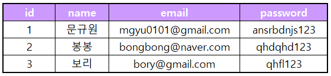
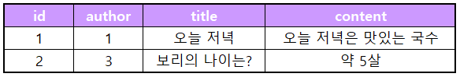
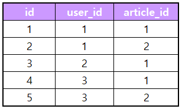
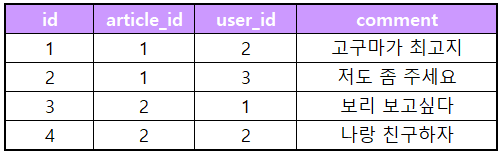

# **ARTICLE DATABASE DESIGN**
 

## **USER**

* **PK : id**

  

## **ARTICLE**

* **PK : id**
* **FK : ARTICLE(author)  &#8594;  USER(id)** 

  

## **LIKE**

* **PK : id**
* **FK**  
    **1. LIKE(user_id)  &#8594;  USER(id)** 
    **2. LIKE(article_id)  &#8594;  ARTICLE(id)**

  

## **COMMENT**

* **PK : id**
* **FK**  
    **1. COMMENT(article_id)  &#8594;  ARTICLE(id)** 
    **2. COMMENT(user_id)  &#8594;  USER(id)**